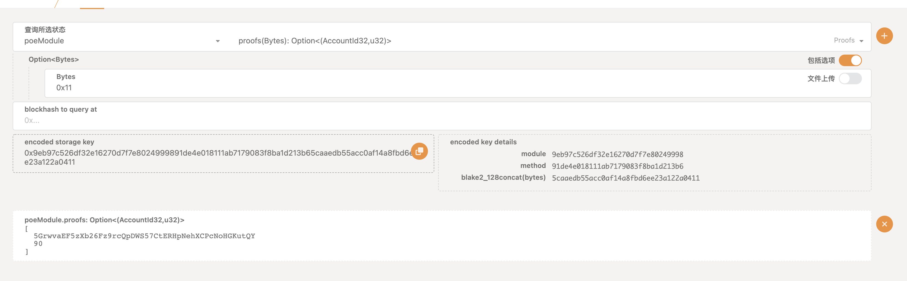

# Proof Of Existence

## Node Run

## Web Check

## Init State

## Create Claim
[code](https://github.com/simonhgao/substrate-node-template/blob/coconu/proof_exercise/pallets/poe/src/lib.rs)

### Create Claim By Alice

### After Create Claim

## Revoke Claim
[code](https://github.com/simonhgao/substrate-node-template/blob/coconu/proof_exercise/pallets/poe/src/lib.rs)

### Revoke Claim By Alice

## After Revoke Claim

## Transfer Claim
[code](https://github.com/simonhgao/substrate-node-template/blob/coconu/proof_exercise/pallets/poe/src/lib.rs)

### Create Claim By Alice

### The Status of 0x11

### Transfer 0x11 to Dave

### After Transfer

### AccountId of Dave

